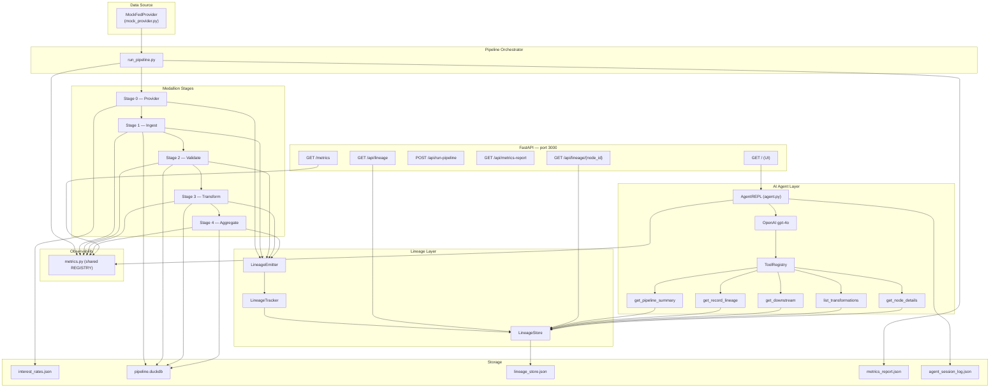
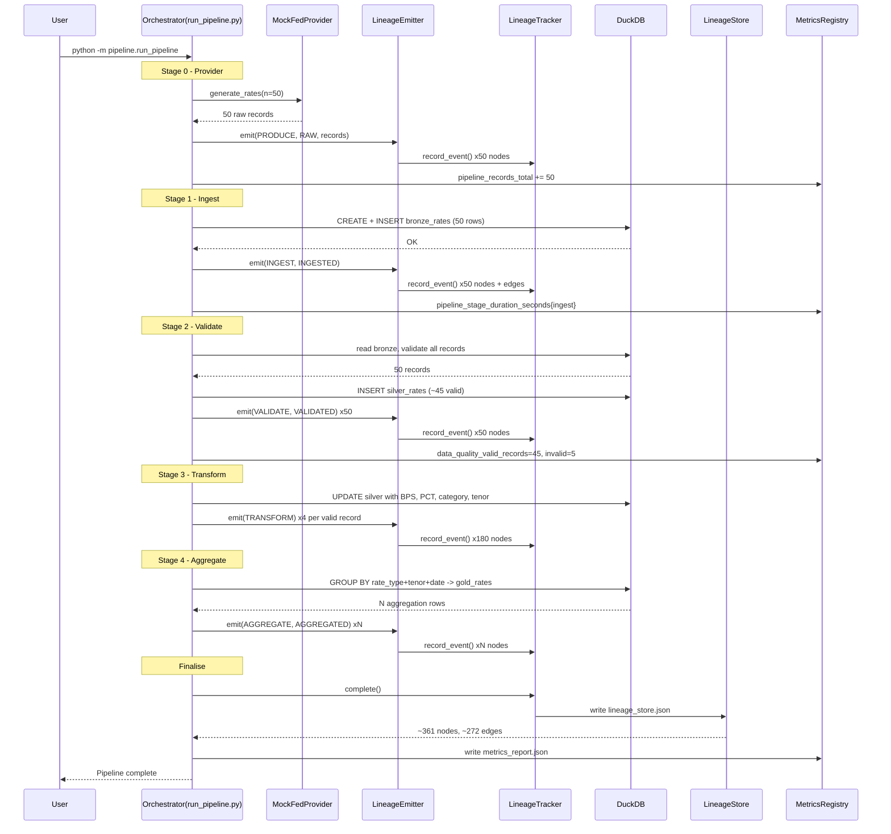
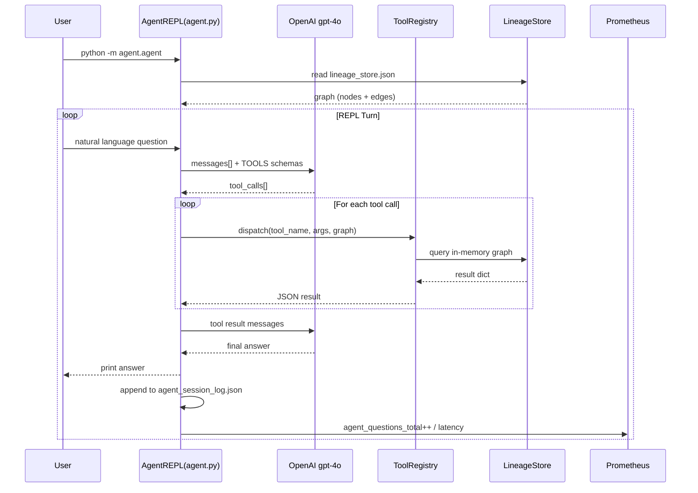
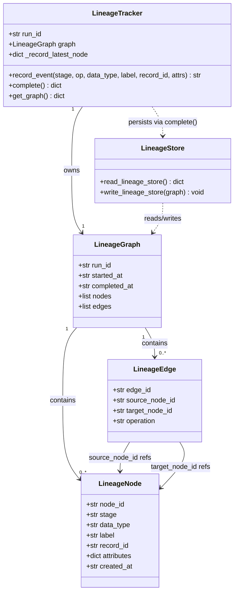
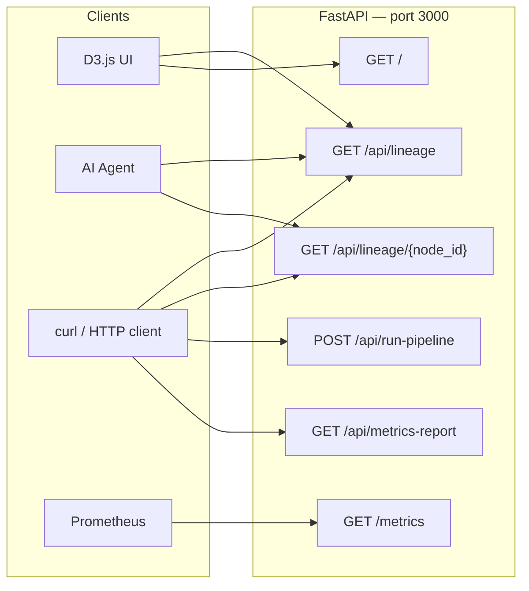

# DataLineageAgent

> AI-native data intelligence system enabling end-to-end lineage tracking and natural language–driven provenance querying to accelerate root cause analysis, enhance data transparency, and strengthen governance across multi-layer financial data pipelines.

---

## Overview

DataLineageAgent is an AI-native data intelligence system that delivers end-to-end lineage tracking and natural language–driven provenance querying across multi-layer financial data pipelines. It processes mock interest rate records (SOFR, LIBOR, FED_FUNDS_RATE) through a four-tier medallion architecture — raw ingestion through bronze, silver, and gold analytical layers — while capturing every transformation event as a structured lineage graph in real time.

The system exposes a GPT-4o powered conversational agent that answers natural-language questions about data provenance: where a record originated, what transformations it underwent, and which downstream aggregations it contributed to. This accelerates root cause analysis, enhances data transparency, and strengthens governance across the pipeline.

Lineage data is persisted as a JSON graph and visualised as an interactive force-directed DAG in the browser via D3.js. The service is deployed on Google Kubernetes Engine (GKE) with Prometheus metrics scraping and a Grafana observability dashboard.

---

## Architecture



| Layer | Purpose |
|---|---|
| Data Source | MockFedProvider generates 50 seeded interest rate records with ~10% intentionally bad values for DQ testing |
| Pipeline Orchestrator | `run_pipeline.py` sequences all 5 stages, manages DuckDB connection and LineageTracker lifetime |
| Medallion Stages | Five-stage transformation: raw JSON → bronze → silver (validated + enriched) → gold (aggregated) |
| Lineage Layer | LineageEmitter wraps every stage; LineageTracker builds the DAG; LineageStore persists to JSON |
| Storage | Raw JSON, DuckDB (3 tables), lineage graph, metrics report, agent session log |
| AI Agent Layer | gpt-4o REPL with 5 function-calling tools that query the lineage graph |
| API + UI | FastAPI on port 3000 serves the D3.js DAG and all data endpoints |
| Observability | 10 Prometheus metrics exposed at `GET /metrics` |

---

## Medallion Pipeline



| Stage | File | Operation | Input | Output | DuckDB Table |
|---|---|---|---|---|---|
| Stage 0: Provider | `pipeline/stages/mock_provider.py` | PRODUCE | seed + config | 50 raw JSON records | — |
| Stage 1: Ingest | `pipeline/stages/ingest.py` | INGEST | `interest_rates.json` | 50 rows inserted | `bronze_rates` |
| Stage 2: Validate | `pipeline/stages/validate.py` | VALIDATE | `bronze_rates` | ~45 valid, ~5 invalid | `silver_rates` |
| Stage 3: Transform | `pipeline/stages/transform.py` | TRANSFORM ×4/record | valid silver records | BPS, PCT, rate category, tenor norm | `silver_rates` (updated) |
| Stage 4: Aggregate | `pipeline/stages/aggregate.py` | AGGREGATE | `silver_rates` (is_valid=true) | daily avg/min/max per rate_type+tenor+date | `gold_rates` |

---

## AI Lineage Agent



The agent loads the lineage graph once at startup then enters a REPL loop. Each turn sends the full conversation history plus the 5 tool schemas to gpt-4o. The model returns tool calls which are dispatched synchronously, results are appended as tool messages, and gpt-4o produces a final natural-language answer.

| Tool | Description | Key Parameters | Returns |
|---|---|---|---|
| `get_pipeline_summary` | Overall pipeline statistics | — | record counts, stage durations, node/edge totals, orphan count |
| `get_record_lineage` | Full upstream lineage chain for one record | `record_id` | ordered list of nodes from RAW to GOLD |
| `get_downstream` | All downstream nodes from a given node | `node_id` | list of descendant nodes and edges |
| `list_transformations` | All TRANSFORM operations in the graph | optional `record_id` filter | transform nodes with BPS/PCT/category/tenor attributes |
| `get_node_details` | Complete detail for a single node | `node_id` | full node dict including attributes and connected edges |

---

## Data Models



- **LineageNode** — one event in the pipeline (e.g. a RAW record produced, a TRANSFORM applied). Keyed by `node_id`, linked to a `record_id`, carries stage/data_type metadata and arbitrary `attributes`.
- **LineageEdge** — directed link between two nodes representing a data flow operation (PRODUCE, INGEST, VALIDATE, TRANSFORM, AGGREGATE).
- **LineageGraph** — the full DAG for one pipeline run: `run_id`, timestamps, and lists of nodes + edges.
- **Auto-chaining** — LineageTracker maintains `_record_latest_node` so each new event for a `record_id` is automatically linked to the previous node for that record, building the chain without explicit parent IDs.

---

## API Reference



| Method | Path | Description | Returns |
|---|---|---|---|
| `GET` | `/` | Serve the D3.js DAG visualization | HTML (ui/index.html) |
| `GET` | `/api/lineage` | Full lineage graph | `{run_id, nodes[], edges[]}` |
| `GET` | `/api/lineage/node/{node_id}` | Single lineage node by ID | Node object or 404 |
| `POST` | `/api/run-pipeline` | Trigger pipeline programmatically | `{status, metrics}` |
| `GET` | `/api/metrics-report` | Last pipeline metrics report | `{pipeline, lineage}` JSON |
| `GET` | `/metrics` | Prometheus scrape endpoint | Prometheus text exposition |

---

## Observability

All metrics are registered in a shared `REGISTRY` in `observability/metrics.py` and exposed at:

```
GET http://localhost:3000/metrics
```

| Metric | Type | Labels | Description |
|---|---|---|---|
| `pipeline_runs_total` | Counter | `status` | Total pipeline runs (success/error) |
| `pipeline_records_total` | Counter | `stage`, `status` | Records processed per stage |
| `pipeline_stage_duration_seconds` | Histogram | `stage` | Duration of each pipeline stage |
| `data_quality_valid_records` | Gauge | — | Count of valid records in last run |
| `data_quality_invalid_records` | Gauge | — | Count of invalid records in last run |
| `data_quality_validation_errors_total` | Counter | `error_type` | Validation errors by type |
| `lineage_nodes_total` | Gauge | — | Total lineage nodes in last run |
| `lineage_edges_total` | Gauge | — | Total lineage edges in last run |
| `lineage_orphan_nodes` | Gauge | — | Nodes with no incoming edges (excl. RAW roots) |
| `agent_tool_calls_total` | Counter | `tool_name`, `status` | Agent tool invocations by name and outcome |
| `agent_response_latency_seconds` | Histogram | — | End-to-end latency per agent turn |
| `agent_questions_total` | Counter | — | Total questions answered by the agent |

---

## Project Structure

```
DataLineageAgent/
├── agent/
│   ├── agent.py               # gpt-4o REPL entrypoint
│   ├── tool_registry.py       # TOOLS list + dispatch()
│   └── tools/
│       ├── get_pipeline_summary.py
│       ├── get_record_lineage.py
│       ├── get_downstream.py
│       ├── list_transformations.py
│       └── get_node_details.py
├── api/
│   └── main.py                # FastAPI app (port 3000)
├── data/                      # Generated at runtime
│   ├── raw/
│   │   └── interest_rates.json
│   ├── pipeline.duckdb
│   ├── lineage_store.json
│   ├── metrics_report.json
│   └── agent_session_log.json
├── docs/                      # Technical documentation
│   ├── team_context.md
│   ├── architecture_design.md
│   └── product_documentation.md
├── lineage/
│   ├── tracker.py             # LineageTracker, LineageNode, LineageEdge
│   └── store.py               # read/write lineage_store.json
├── observability/
│   └── metrics.py             # All Prometheus metric definitions
├── pipeline/
│   ├── run_pipeline.py        # Orchestrator
│   ├── lineage_emitter.py     # Thin emit() wrapper
│   └── stages/
│       ├── mock_provider.py   # Stage 0
│       ├── ingest.py          # Stage 1
│       ├── validate.py        # Stage 2
│       ├── transform.py       # Stage 3
│       └── aggregate.py       # Stage 4
├── tests/                     # 27 tests across 4 modules
├── ui/
│   └── index.html             # D3.js DAG visualization
├── DataLineageAgent_Architecture.drawio
├── prometheus.yml
├── requirements.txt
└── README.md
```

---

## Prerequisites

- Python 3.12+
- pip
- OpenAI API key (required only for the AI agent)
- All other dependencies are in `requirements.txt` (DuckDB, FastAPI, uvicorn, prometheus-client, openai, python-dotenv)

---

## Quick Start

```bash
# 1. Install dependencies
pip install -r requirements.txt

# 2. Configure environment
cp .env.example .env
# Edit .env and set: OPENAI_API_KEY=sk-...

# 3. Run the pipeline (generates data + lineage graph)
python -m pipeline.run_pipeline

# 4. Start the API server + D3.js visualization
uvicorn api.main:app --port 3000
# Open http://localhost:3000 in your browser

# 5. Start the AI lineage agent (separate terminal)
python -m agent.agent
```

---

## Running Tests

```bash
python -m pytest tests/ -v
```

27 tests across 4 modules:

| Module | Tests | Coverage |
|---|---|---|
| Pipeline stages | ~10 | mock_provider, ingest, validate, transform, aggregate |
| LineageTracker | ~6 | node creation, edge auto-chaining, complete() |
| LineageStore | ~4 | read/write round-trip, missing file handling |
| API endpoints | ~7 | all 6 routes, 404 handling, pipeline trigger |

---

## GKE Deployment

The service is deployed on Google Kubernetes Engine. All deployment artifacts are in the `k8s/` directory.

### Live Endpoints

| Service | URL |
|---|---|
| Data Lineage UI | http://34.31.145.177 |
| REST API + Swagger | http://34.31.145.177/docs |
| Prometheus | http://136.113.33.154:9090 |
| Grafana Dashboard | http://136.114.77.0/d/cfhdfa6i2p534e/data-lineage-agent |

### Infrastructure

| Component | Detail |
|---|---|
| GCP Project | `gen-lang-client-0896070179` |
| Cluster | `helloworld-cluster` (us-central1) |
| Namespace | `data-lineage` |
| Image | `gcr.io/gen-lang-client-0896070179/data-lineage-agent:latest` |
| Persistent storage | 2Gi PVC (`standard-rwo`) mounted at `/app/data` |
| Secret | `data-lineage-secrets` — `OPENAI_API_KEY` injected via K8s Secret |

### Deploy from Scratch

```bash
# 1. Authenticate and set project
gcloud auth login
gcloud config set project gen-lang-client-0896070179

# 2. Get cluster credentials
gcloud container clusters get-credentials helloworld-cluster --region us-central1

# 3. Apply namespace, PVC, and secret
kubectl apply -f k8s/namespace.yaml
kubectl apply -f k8s/pvc.yaml
kubectl create secret generic data-lineage-secrets \
  --namespace=data-lineage \
  --from-literal=OPENAI_API_KEY='sk-...'

# 4. Build and push image
docker build -t gcr.io/gen-lang-client-0896070179/data-lineage-agent:latest .
docker push gcr.io/gen-lang-client-0896070179/data-lineage-agent:latest

# 5. Deploy
kubectl apply -f k8s/deployment.yaml
kubectl apply -f k8s/service.yaml

# 6. Seed data
curl -X POST http://<EXTERNAL_IP>/api/run-pipeline
```

### Observability

```bash
# Apply Prometheus scrape config
kubectl apply -f k8s/prometheus-configmap.yaml

# Import Grafana dashboard
curl -u admin:<password> -X POST http://<GRAFANA_IP>/api/dashboards/db \
  -H 'Content-Type: application/json' \
  -d @k8s/grafana-dashboard-data-lineage.json
```

---

## Known Limitations

This is a local POC. The following are known boundaries:

- **Mock data only** — no real market data feed; replace MockFedProvider for production use
- **No authentication** — FastAPI has no auth; suitable for local use only
- **Single-process metrics** — shared Prometheus REGISTRY does not support multi-process deployments
- **No lineage cache** — `lineage_store.json` is read from disk on every API call
- **Agent session log grows unbounded** — no rotation; fine for POC
- **OpenAI dependency** — agent requires network access and a valid API key; no offline fallback
- **DuckDB tables dropped on each run** — pipeline always starts clean; no incremental loading
- **Invalid records still get lineage nodes** — all records (valid and invalid) appear in the lineage graph

---

## License

MIT
