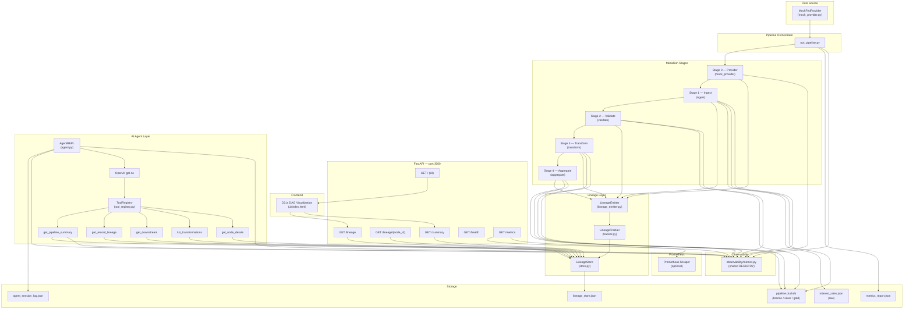
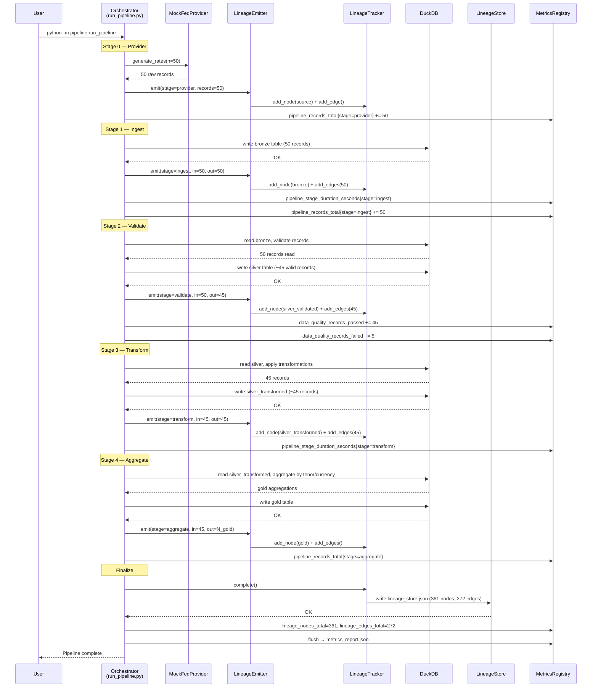
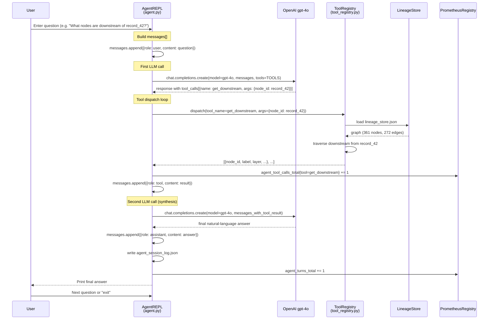
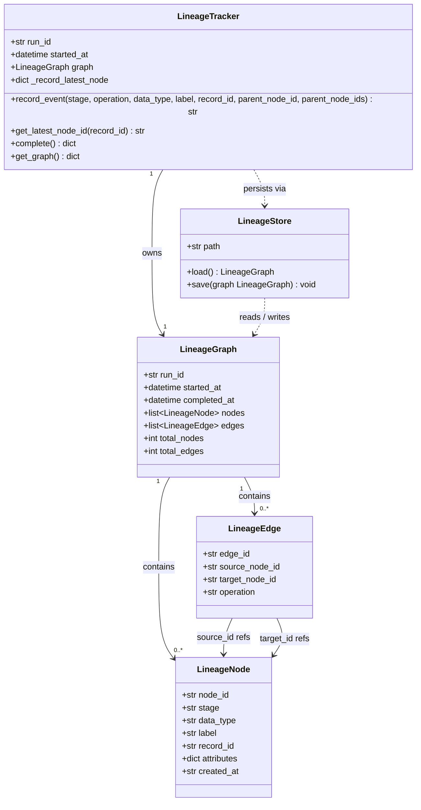
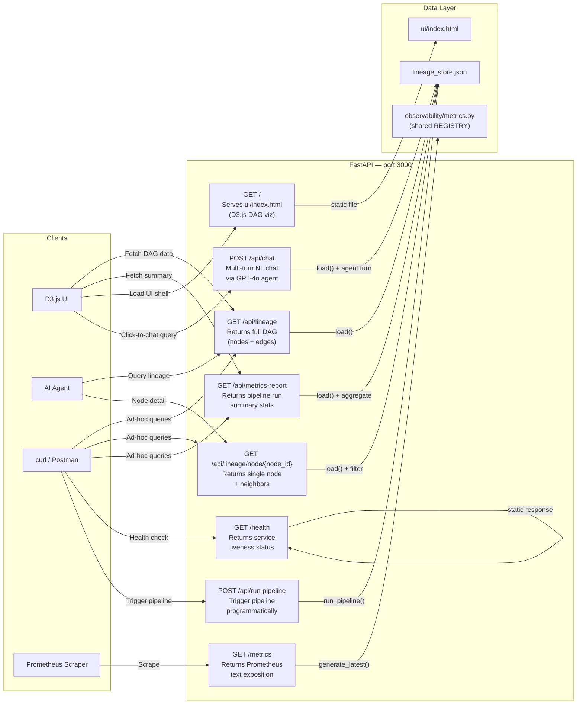

# DataLineageAgent — Architecture Design

> Generated: 2026-03-22
> Purpose: Reference architecture for the local POC — finance interest rate data pipeline, OpenAI gpt-4o lineage agent, and D3.js visualization.

---

## Diagram 1 — High-Level Architecture

---

## Diagram 2 — Pipeline Run Sequence

---

## Diagram 3 — Agent Q&A Sequence

---

## Diagram 4 — Lineage Graph Data Model

---

## Diagram 5 — API Endpoint Map

---

## Cross-Cutting Concerns

| Concern | Current State | Note |
|---|---|---|
| Single-process metrics registry | `observability/metrics.py` uses one shared `REGISTRY` | Works for single-process POC; multi-process Prometheus multiprocessing mode needed for production. |
| lineage_store.json read on every API call | `LineageStore.load()` reads from disk per request | No in-memory cache; acceptable for POC, but adds latency at scale. |
| No auth on API or agent | FastAPI has no authentication | Acceptable for local POC only. |
| Agent session log append pattern | `agent_session_log.json` grows unbounded | Fine for POC; needs rotation in production. |
| OpenAI gpt-4o dependency | External API call per agent turn | Requires network + API key; no fallback. |
| POST /api/chat stateless design | Full `messages[]` array sent and returned each turn | Client owns conversation state; server remains stateless and horizontally scalable. |

---

## Design Changes — 2026-03-30

### 1. Label-Match Fallback in `get_downstream`

`get_downstream` previously required an exact `node_id` UUID. It now falls back to a case-insensitive partial label/attribute search when the supplied value is not a known UUID. The fallback mirrors the existing behaviour of `get_node_details`.

Resolution rules (in priority order):
1. Exact `node_id` UUID match — use directly.
2. Label/attribute partial match returning exactly one node — resolve and proceed.
3. Match returning 2–5 nodes — return a disambiguation list with a hint to supply `record_id`.
4. Match returning >5 nodes — return a too-many-results error with a sample of labels.
5. No match — return an error.

### 2. `record_id` Disambiguation Parameter in `get_downstream`

An optional `record_id` parameter was added to `get_downstream`. When supplied alongside a label query, candidate nodes are filtered to those whose `record_id` matches before applying the resolution rules above. If the filter produces zero candidates, the unfiltered match list is used as a fallback.

### 3. Multi-Parent Edge Wiring in `LineageTracker.record_event()`

`record_event()` gained a `parent_node_ids: list[str]` parameter. When supplied, one edge is created from each parent to the new node. This replaces the single `parent_node_id` parameter and the automatic record-chain parent — `parent_node_ids` takes full precedence when present.

| Parameter | Behaviour |
|---|---|
| `parent_node_ids` provided | Create one edge per entry; ignore `parent_node_id` and record-chain. |
| `parent_node_id` provided | Create one edge from that node; ignore record-chain. |
| Neither provided | Auto-chain: create one edge from the latest node for `record_id`. |

### 4. SILVER→GOLD Edge Wiring in `aggregate.py`

The aggregate stage previously emitted GOLD nodes with no incoming edges, leaving them as orphans in the lineage graph. It now resolves the latest SILVER node for each source `record_id` via `LineageEmitter.get_latest_node_id()` and passes those IDs as `parent_node_ids` when emitting each GOLD node. This closes the SILVER→GOLD gap in the full RAW→BRONZE→SILVER→GOLD chain.

### 5. Embedded Chat Drawer & Click-to-Chat UX

The browser UI (`ui/index.html`) was extended with a collapsible chat drawer backed by `POST /api/chat`. Clicking any DAG node pre-fills the chat input with a contextual lineage question for that node, reducing the friction between visual exploration and conversational investigation. The chat layer is stateless on the server: the full `messages[]` array is round-tripped on each request.
