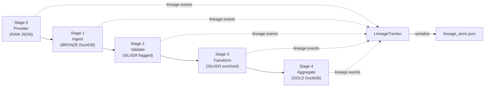
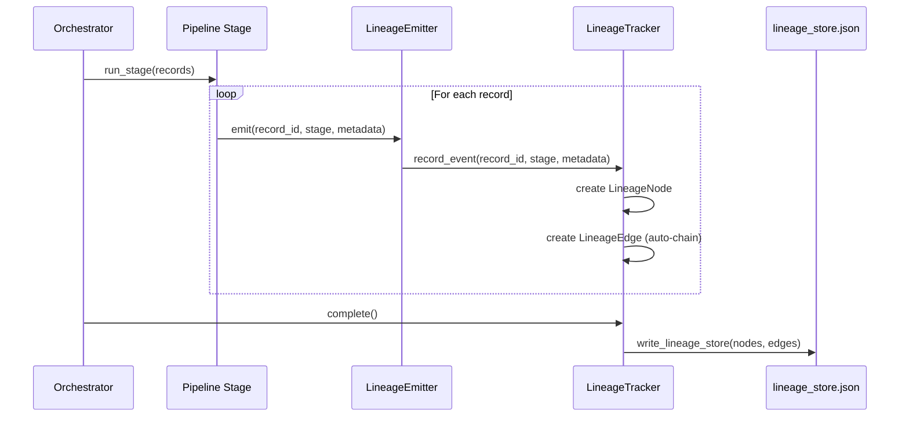
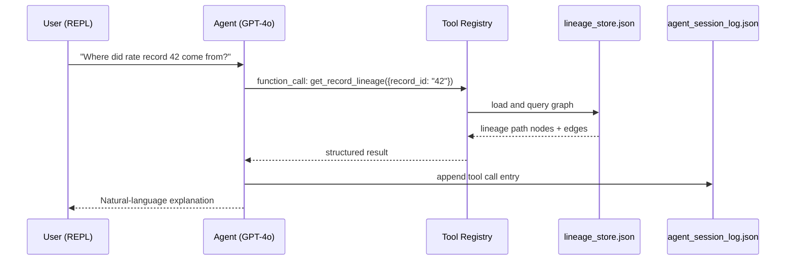

# DataLineageAgent — Product Documentation

Generated: 2026-03-22
Version: 1.0 (POC)

---

## Table of Contents

1. [Product Overview](#1-product-overview)
2. [Architecture Summary](#2-architecture-summary)
3. [User Personas & Use Cases](#3-user-personas--use-cases)
4. [Feature Inventory](#4-feature-inventory)
5. [API Reference](#5-api-reference)
6. [Data Models](#6-data-models)
7. [Observability Reference](#7-observability-reference)
8. [Known Limitations & POC Boundaries](#8-known-limitations--poc-boundaries)
9. [Product Roadmap (Suggested)](#9-product-roadmap-suggested)

---

## 1. Product Overview

### What is DataLineageAgent?

DataLineageAgent is a local proof-of-concept application that demonstrates end-to-end data lineage tracking for a finance interest rate data pipeline. It processes mock interest rate records (SOFR, LIBOR, FED_FUNDS_RATE) through a four-tier medallion architecture — raw ingestion through bronze, silver, and gold analytical layers — while capturing every transformation event as a structured lineage graph in real time.

The system exposes a GPT-4o powered conversational REPL agent that answers natural-language questions about data provenance: where a record originated, what transformations it underwent, which downstream aggregations it contributed to, and why a particular value looks the way it does. Lineage data is persisted as a JSON graph and visualized as an interactive force-directed DAG in the browser via D3.js, providing an immediate, explorable picture of the full data flow.

DataLineageAgent is built as a self-contained local system with no external dependencies beyond an OpenAI API key. Its primary goal is to validate the architectural pattern — dynamic runtime lineage capture plus AI-powered querying — before investing in a production-grade implementation.

### Problem it Solves

Financial data pipelines transform raw rate feeds through many stages before the data reaches risk models, reporting systems, or regulatory submissions. When a downstream value is questioned — by an auditor, a risk analyst, or an automated data quality check — tracing it back to its source is typically a manual, time-consuming process. Teams must read pipeline code, inspect database tables, and cross-reference logs across multiple systems.

DataLineageAgent captures lineage automatically at runtime, requiring no manual annotation. Combined with a natural-language agent, it reduces the time to answer provenance questions from hours to seconds.

### Key Value Propositions

- **Automatic lineage capture**: No manual tagging required. Every pipeline stage emits structured lineage events as it runs.
- **Natural-language querying**: Non-technical stakeholders can ask provenance questions without writing SQL or reading code.
- **Visual graph exploration**: The D3.js DAG provides an interactive view of the entire data flow.
- **Observable pipeline**: Prometheus metrics expose pipeline health, data quality ratios, and agent usage to any standard monitoring stack.
- **Self-contained POC**: Runs entirely locally with a single pip install and one environment variable.

---

## 2. Architecture Summary

### Medallion Architecture (RAW to BRONZE to SILVER to GOLD)

| Tier | Stage | Description |
|------|-------|-------------|
| RAW | Stage 0 — Provider | Mock data generated and written to `data/raw/interest_rates.json`. 50 records, ~10% intentionally bad values. |
| BRONZE | Stage 1 — Ingest | Raw JSON loaded into DuckDB `bronze_rates` table as-is. No transformation; all records ingested regardless of quality. |
| SILVER | Stage 2 — Validate | Records validated against business rules (rate range 0.001–0.30). `is_valid` flag set. Both valid and invalid records stored in `silver_rates`. |
| SILVER | Stage 3 — Transform | Valid records enriched with 4 derived columns: `rate_bps`, `rate_category`, `tenor_days`, `tenor_normalized`. Written back to `silver_rates`. |
| GOLD | Stage 4 — Aggregate | Valid silver records grouped by `rate_type + tenor_normalized + effective_date`. Avg/min/max/count computed. Written to `gold_rates`. |



### How Lineage Tracking Works

Each pipeline stage holds a `LineageEmitter` instance (a thin wrapper around a shared `LineageTracker`). When a stage processes a record, it calls `emitter.emit()` with the record ID, stage name, and a metadata dict. The `LineageTracker` creates a `LineageNode` for that event and automatically chains it to the previous node for the same `record_id` by creating a `LineageEdge`. This auto-chaining means lineage is built incrementally without any cross-stage coordination.

At the end of the pipeline run, `LineageTracker.complete()` serializes the full graph (nodes and edges) to `data/lineage_store.json`. A typical 50-record run produces approximately 361 nodes and 272 edges.

The N-to-1 aggregation pattern is handled naturally: each silver-transformed node emits an edge to the same gold aggregation node, correctly representing many-to-one data flows.



### How the AI Agent Adds Value

The GPT-4o REPL agent loads `lineage_store.json` as a plain dictionary and exposes five structured tool functions via OpenAI function-calling. Users type natural-language questions; the agent selects and invokes the appropriate tool, interprets the result, and replies in plain English. The agent operates entirely on the serialized lineage graph — it does not rerun the pipeline — making it fast and safe for read-only analysis.

All agent tool calls are logged to `data/agent_session_log.json` and tracked via Prometheus metrics.



---

## 3. User Personas & Use Cases

### Persona 1: Data Engineer

**Goals**: Build and maintain reliable data pipelines. Quickly identify which pipeline stage introduced a data quality issue. Validate that lineage is captured correctly after a code change.

**Pain Points**: Debugging multi-stage pipelines is slow because errors manifest downstream of their root cause. Understanding what transformations were applied to a specific record requires reading stage code and cross-referencing logs manually.

**How they use DataLineageAgent**:
- Run the pipeline after code changes and inspect the lineage graph to confirm new transformation nodes appear correctly.
- Use the agent REPL to trace a specific failing record: "Show me all transformation steps for record ID 7."
- Monitor `pipeline_stage_duration_seconds` and `data_quality_pass_rate` Prometheus metrics to catch regressions.
- Use `GET /api/lineage` to script automated lineage validation in CI.

### Persona 2: Risk Analyst

**Goals**: Understand the provenance of interest rate values used in risk models. Explain to auditors why a gold-layer aggregated rate has a specific value. Identify which raw source records contributed to a given aggregation.

**Pain Points**: Gold-layer aggregated values are several hops removed from raw data. Without lineage, tracing an aggregated rate back to its source records requires manual joins across multiple tables. Audit requests are time-sensitive.

**How they use DataLineageAgent**:
- Open the D3.js DAG visualization at `http://localhost:3000` to visually explore the data flow.
- Ask the agent: "Which records contributed to the SOFR overnight average for 2024-01-15?"
- Ask the agent: "Was record 23 flagged as invalid? Why?"
- Export lineage query results for audit trail documentation.

### Persona 3: DevOps / SRE

**Goals**: Monitor pipeline health in real time. Detect data quality degradation before it reaches gold-layer consumers. Integrate pipeline observability into existing Prometheus/Grafana stacks.

**Pain Points**: Finance data pipelines often lack structured metrics, making alerting on data quality (not just infrastructure) difficult. Without lineage counts, it is hard to know if a pipeline run processed fewer records than expected.

**How they use DataLineageAgent**:
- Scrape `GET /metrics` from Prometheus using the provided `prometheus.yml`.
- Alert on `data_quality_pass_rate` dropping below threshold (e.g., below 0.85 suggests more bad records than the designed ~10%).
- Track `lineage_nodes_total` and `lineage_edges_total` to detect incomplete pipeline runs.
- Monitor `agent_tool_calls_total` to understand agent usage patterns.

### Use Cases (User Story Format)

1. **As a Data Engineer**, I want to trace every transformation applied to a specific interest rate record so that I can verify the pipeline logic is correct after a code change.

2. **As a Risk Analyst**, I want to ask in plain English which source records contributed to a gold-layer aggregated rate so that I can respond to audit inquiries without writing SQL.

3. **As a Risk Analyst**, I want to view the full data lineage graph as an interactive DAG so that I can visually confirm the data flow from raw feed to gold aggregation.

4. **As a DevOps Engineer**, I want to scrape Prometheus metrics from the pipeline API so that I can alert on data quality degradation in my existing Grafana dashboard.

5. **As a Data Engineer**, I want to query downstream nodes from any lineage node via the REST API so that I can programmatically assess the blast radius of a data quality issue.

6. **As a Risk Analyst**, I want the agent to explain why a specific record was marked invalid so that I can determine whether it represents a genuine data error or a validation rule defect.

---

## 4. Feature Inventory

| # | Feature | Description | Status |
|---|---------|-------------|--------|
| 1 | Mock data provider | Generates 50 realistic interest rate records (SOFR, LIBOR, FED_FUNDS_RATE) with ~10% intentionally bad values | Implemented |
| 2 | Bronze ingestion | Loads all raw records into DuckDB `bronze_rates` table without filtering | Implemented |
| 3 | Silver validation | Validates rate range (0.001–0.30); flags records with `is_valid`; stores both valid and invalid records | Implemented |
| 4 | Silver transformation | Applies 4 derived column calculations per valid record: `rate_bps`, `rate_category`, `tenor_days`, `tenor_normalized` | Implemented |
| 5 | Gold aggregation | Groups valid silver records by rate type, tenor, and date; computes avg/min/max/count statistics | Implemented |
| 6 | Dynamic lineage capture | Auto-chains lineage nodes per record across all stages at runtime via `LineageTracker` and `LineageEmitter` | Implemented |
| 7 | Lineage graph persistence | Serializes full node+edge graph to `data/lineage_store.json` after each pipeline run | Implemented |
| 8 | GPT-4o REPL agent | Conversational agent with OpenAI function-calling for natural-language lineage queries | Implemented |
| 9 | Agent tool: get_pipeline_summary | Returns high-level stats: total nodes, edges, stages, record count | Implemented |
| 10 | Agent tool: get_record_lineage | Returns full ordered lineage path for a given record ID | Implemented |
| 11 | Agent tool: get_downstream | Returns all downstream nodes from a given node ID | Implemented |
| 12 | Agent tool: list_transformations | Lists all transformation nodes applied to a given record | Implemented |
| 13 | Agent tool: get_node_details | Returns full metadata for a given node ID, including parents | Implemented |
| 14 | FastAPI REST API | 6 endpoints serving lineage data, node details, metrics, and the UI | Implemented |
| 15 | D3.js DAG visualization | Interactive force-directed graph of the full lineage DAG in the browser | Implemented |
| 16 | Prometheus metrics | 10 metrics across pipeline, data quality, lineage, and agent dimensions | Implemented |
| 17 | Agent session logging | All tool calls logged to `data/agent_session_log.json` for auditability | Implemented |
| 18 | Metrics report export | `data/metrics_report.json` written after each pipeline run | Implemented |
| 19 | pytest test suite | 27 tests across pipeline, lineage, agent tools, and API modules | Implemented |
| 20 | Multi-currency support | Support for non-USD rate sources | POC (USD only) |
| 21 | Real data feed connectors | Integration with live rate data providers (Bloomberg, Refinitiv) | POC (mock only) |
| 22 | Authentication / RBAC | User authentication and role-based access control for API and agent | Not implemented |
| 23 | Persistent agent memory | Cross-session conversation history and context for the agent | Not implemented |
| 24 | Horizontal scaling | Distributed pipeline execution and lineage store | Not implemented |

---

## 5. API Reference

Base URL: `http://localhost:3000`

All endpoints return JSON unless otherwise noted. The API is served by FastAPI (`api/main.py`).

---

### GET /

**Description**: Serves the D3.js DAG visualization UI.

**Request Parameters**: None

**Response**: HTML page (`ui/index.html`). Loads D3.js from CDN and fetches lineage data from `GET /api/lineage`.

**Example**:
```
GET http://localhost:3000/
```

---

### GET /api/lineage

**Description**: Returns the full lineage graph (all nodes and edges) from `data/lineage_store.json`.

**Request Parameters**: None

**Response Schema**:
```json
{
  "nodes": [
    {
      "node_id": "string",
      "record_id": "string",
      "stage": "string",
      "event_type": "string",
      "timestamp": "string (ISO 8601)",
      "metadata": {}
    }
  ],
  "edges": [
    {
      "edge_id": "string",
      "source_node_id": "string",
      "target_node_id": "string",
      "relationship": "string"
    }
  ]
}
```

**Error Responses**:
- `404 Not Found` — `lineage_store.json` does not exist (pipeline has not been run)

**Example**:
```
GET http://localhost:3000/api/lineage
```

---

### GET /api/lineage/{node_id}

**Description**: Returns details for a single lineage node by its node ID.

**Path Parameters**:
| Parameter | Type | Description |
|-----------|------|-------------|
| `node_id` | string | The unique node identifier (e.g., `raw_001_1706000000`) |

**Response Schema**:
```json
{
  "node_id": "string",
  "record_id": "string",
  "stage": "string",
  "event_type": "string",
  "timestamp": "string (ISO 8601)",
  "metadata": {},
  "parents": ["string"]
}
```

**Error Responses**:
- `404 Not Found` — node ID does not exist in the lineage store

**Example**:
```
GET http://localhost:3000/api/lineage/raw_001_1706000000
```

---

### GET /api/nodes/{node_id}/downstream

**Description**: Returns all downstream nodes reachable from the given node ID by following edges in the lineage graph.

**Path Parameters**:
| Parameter | Type | Description |
|-----------|------|-------------|
| `node_id` | string | The source node identifier |

**Response Schema**:
```json
{
  "node_id": "string",
  "downstream_nodes": [
    {
      "node_id": "string",
      "record_id": "string",
      "stage": "string",
      "event_type": "string"
    }
  ]
}
```

**Error Responses**:
- `404 Not Found` — node ID does not exist

**Example**:
```
GET http://localhost:3000/api/nodes/raw_001_1706000000/downstream
```

---

### GET /api/summary

**Description**: Returns a high-level summary of the lineage graph.

**Request Parameters**: None

**Response Schema**:
```json
{
  "total_nodes": "integer",
  "total_edges": "integer",
  "stages": ["string"],
  "record_count": "integer",
  "generated_at": "string (ISO 8601)"
}
```

**Example**:
```
GET http://localhost:3000/api/summary
```

---

### GET /metrics

**Description**: Returns Prometheus metrics in text exposition format. Scraped by Prometheus server using the provided `prometheus.yml`.

**Request Parameters**: None

**Response**: Plain text, `Content-Type: text/plain; version=0.0.4`

**Example**:
```
GET http://localhost:3000/metrics
```

---

## 6. Data Models

### LineageNode

Represents a single processing event for a specific record at a specific pipeline stage.

| Field | Type | Description |
|-------|------|-------------|
| `node_id` | string | Unique identifier. Format: `{stage}_{record_id}_{unix_timestamp}` |
| `record_id` | string | The interest rate record this node belongs to (e.g., `001`) |
| `stage` | string | Pipeline stage name: `raw`, `bronze`, `silver_validated`, `silver_transformed`, `gold` |
| `event_type` | string | Event classification: `RAW`, `INGESTED`, `VALIDATED`, `TRANSFORMED`, `AGGREGATED` |
| `timestamp` | string | ISO 8601 UTC timestamp of when the event was emitted |
| `metadata` | object | Stage-specific payload. See per-stage details below. |

**Metadata payloads by stage**:
- **raw**: `{rate_type, tenor, rate_value, effective_date, currency}`
- **bronze**: `{source_file, row_count, ingest_timestamp}`
- **silver_validated**: `{is_valid, validation_errors: [], rate_value}`
- **silver_transformed**: `{rate_bps, rate_category, tenor_days, tenor_normalized}`
- **gold**: `{rate_type, tenor_normalized, effective_date, avg_rate, min_rate, max_rate, record_count}`

---

### LineageEdge

Represents a directed relationship between two lineage nodes.

| Field | Type | Description |
|-------|------|-------------|
| `edge_id` | string | Unique identifier. Format: `{source_node_id}__{target_node_id}` |
| `source_node_id` | string | The upstream (parent) node |
| `target_node_id` | string | The downstream (child) node |
| `relationship` | string | Relationship type: `DERIVED_FROM`, `AGGREGATED_FROM` |

---

### DuckDB Table Schemas

#### bronze_rates

Raw records as ingested, no transformation applied.

| Column | Type | Description |
|--------|------|-------------|
| `record_id` | VARCHAR | Unique record identifier from raw source |
| `rate_type` | VARCHAR | Rate benchmark: `SOFR`, `LIBOR`, or `FED_FUNDS_RATE` |
| `tenor` | VARCHAR | Original tenor string: `overnight`, `1M`, `3M`, `6M` |
| `rate_value` | DOUBLE | Raw rate value as provided (may be out of valid range) |
| `effective_date` | VARCHAR | Date string in `YYYY-MM-DD` format |
| `currency` | VARCHAR | Currency code (always `USD` in POC) |
| `source_file` | VARCHAR | Path to the raw JSON source file |
| `ingest_timestamp` | VARCHAR | ISO 8601 timestamp of when the record was ingested |

#### silver_rates

Validated and enriched records. Contains all bronze records plus validation and transformation columns.

| Column | Type | Description |
|--------|------|-------------|
| `record_id` | VARCHAR | Unique record identifier |
| `rate_type` | VARCHAR | Rate benchmark |
| `tenor` | VARCHAR | Original tenor string |
| `rate_value` | DOUBLE | Rate value (unchanged from bronze) |
| `effective_date` | VARCHAR | Date string |
| `currency` | VARCHAR | Currency code |
| `is_valid` | BOOLEAN | True if rate_value is within 0.001–0.30; False otherwise |
| `validation_errors` | VARCHAR | JSON-encoded list of validation error messages, or empty list |
| `rate_bps` | DOUBLE | Rate in basis points (`rate_value * 10000`). NULL for invalid records. |
| `rate_category` | VARCHAR | Bucketed category: `very_low` (<1%), `low` (1–3%), `medium` (3–5%), `high` (>5%). NULL for invalid. |
| `tenor_days` | INTEGER | Tenor converted to approximate days: overnight=1, 1M=30, 3M=90, 6M=180. NULL for invalid. |
| `tenor_normalized` | VARCHAR | Standardized tenor label. NULL for invalid. |

#### gold_rates

Aggregated analytics layer. One row per unique `rate_type + tenor_normalized + effective_date` combination.

| Column | Type | Description |
|--------|------|-------------|
| `rate_type` | VARCHAR | Rate benchmark |
| `tenor_normalized` | VARCHAR | Standardized tenor label |
| `effective_date` | VARCHAR | Date string |
| `avg_rate` | DOUBLE | Average rate value across all contributing silver records |
| `min_rate` | DOUBLE | Minimum rate value |
| `max_rate` | DOUBLE | Maximum rate value |
| `record_count` | INTEGER | Number of silver records that contributed to this aggregation |
| `aggregation_timestamp` | VARCHAR | ISO 8601 timestamp of when the aggregation was computed |

---

### Output Files

| File | Description |
|------|-------------|
| `data/raw/interest_rates.json` | 50 mock interest rate records as generated by the provider stage |
| `data/pipeline.duckdb` | DuckDB database file containing `bronze_rates`, `silver_rates`, and `gold_rates` tables |
| `data/lineage_store.json` | Full serialized lineage graph: all nodes and edges from the last pipeline run |
| `data/metrics_report.json` | Pipeline run summary: stage durations, record counts, data quality stats, lineage graph size |
| `data/agent_session_log.json` | Log of all agent tool calls: tool name, arguments, result, timestamp |

---

## 7. Observability Reference

All metrics are exposed at `GET /metrics` in Prometheus text format. Defined in `observability/metrics.py` using a shared REGISTRY.

| # | Metric Name | Type | Labels | Description |
|---|-------------|------|--------|-------------|
| 1 | `pipeline_records_total` | Counter | `stage`, `status` | Total records processed per pipeline stage. `status` is `success` or `failure`. |
| 2 | `pipeline_stage_duration_seconds` | Histogram | `stage` | Execution time in seconds for each pipeline stage. Buckets: 0.1s to 30s. |
| 3 | `data_quality_records_total` | Counter | `outcome` | Total records by validation outcome: `valid` or `invalid`. |
| 4 | `data_quality_pass_rate` | Gauge | none | Ratio of valid records to total records processed (0.0–1.0). Updated after validation stage. |
| 5 | `data_quality_errors_total` | Counter | `error_type` | Count of specific validation error types encountered (e.g., `rate_out_of_range`). |
| 6 | `lineage_nodes_total` | Gauge | none | Total number of lineage nodes in the graph after the pipeline run. |
| 7 | `lineage_edges_total` | Gauge | none | Total number of lineage edges in the graph after the pipeline run. |
| 8 | `lineage_event_duration_seconds` | Histogram | `stage` | Time taken to emit and record a lineage event per stage. |
| 9 | `agent_tool_calls_total` | Counter | `tool_name`, `status` | Total agent tool invocations by tool name and status (`success` or `error`). |
| 10 | `agent_query_duration_seconds` | Histogram | `tool_name` | End-to-end time for agent tool call resolution, from function dispatch to result return. |

---

## 8. Known Limitations & POC Boundaries

### What This Is

DataLineageAgent is a local proof-of-concept designed to validate the architectural pattern of dynamic runtime lineage capture combined with AI-powered natural-language querying. It demonstrates the full end-to-end flow on a small, controlled dataset.

### What This Is Not

- **Not a production system**: No authentication, no authorization, no multi-tenancy, no data encryption at rest or in transit.
- **Not connected to real data**: All rate data is synthetically generated mock data. There are no connectors to live rate feeds (Bloomberg, Refinitiv, ICE).
- **Not scalable**: DuckDB is an embedded, single-process database. The lineage store is a flat JSON file loaded entirely into memory. Neither can support production data volumes.
- **Not persistent across agent sessions**: The GPT-4o agent has no memory between REPL sessions. Each `python -m agent.agent` invocation starts fresh.

### Known Implementation Limitations

1. **Tables dropped on each run**: `run_pipeline.py` drops `gold_rates`, `silver_rates`, and `bronze_rates` before each run. There is no incremental or append-only run mode; each run is a full refresh.
2. **10% bad records are by design**: The mock provider intentionally injects ~10% out-of-range values (0.31–0.50) to exercise the validation path. This is not a data quality bug.
3. **Invalid records in lineage**: The validate stage emits lineage nodes for ALL records, including invalid ones. Only valid records proceed to transform and aggregate stages, so invalid records have truncated lineage paths (no transform or gold nodes).
4. **N-to-1 aggregation edges**: All silver-transformed records emit an edge to the same gold aggregation node. The graph correctly represents this, but graph traversal queries on the gold node will return many upstream nodes.
5. **Agent operates on stale data**: The agent reads `lineage_store.json` once at startup. If the pipeline is re-run while the agent is active, the agent will not see the new data until restarted.
6. **No static file mount**: The UI is served by reading `ui/index.html` directly from disk, not via FastAPI `StaticFiles`. The D3.js library is loaded from CDN, requiring internet access to render the visualization.
7. **Shared Prometheus REGISTRY**: All modules import from `observability/metrics.py`. Running multiple FastAPI workers or importing the module in tests without proper isolation can cause `ValueError: Duplicated timeseries` errors.
8. **USD only**: The mock provider generates only USD-denominated rates. Multi-currency support is not implemented.
9. **Single-user REPL**: The agent is a single-user command-line REPL. There is no multi-user support, session isolation, or web-based agent interface.
10. **No retry or error recovery**: If a pipeline stage fails mid-run, the lineage store may be in a partial state. There is no checkpointing or recovery mechanism.

---

## 9. Product Roadmap (Suggested)

### Short-Term: Production Readiness (0–3 months)

- Replace mock data provider with a real rate feed connector (e.g., FRED API for publicly available rates, or an internal feed adapter).
- Add authentication and authorization to the FastAPI endpoints (OAuth2 / API key middleware).
- Replace the flat JSON lineage store with a proper graph database (e.g., Apache Atlas, OpenLineage-compatible backend, or Neo4j).
- Implement incremental pipeline runs (append-only mode) instead of full-refresh drops.
- Add structured error handling and pipeline checkpointing so partial failures can be recovered without a full re-run.
- Fix Prometheus REGISTRY isolation to support multi-worker FastAPI deployments.
- Package as a Docker Compose application for reproducible deployment.

### Medium-Term: Scaling and Features (3–9 months)

- Integrate with the OpenLineage standard so lineage events can be consumed by tools like Apache Atlas, DataHub, or Marquez.
- Add a web-based agent interface (replace CLI REPL with a chat UI).
- Support multi-currency and multi-source rate feeds.
- Add schema evolution tracking: capture and diff schema changes across pipeline runs.
- Build a Grafana dashboard template for the 10 Prometheus metrics.
- Support columnar lineage (field-level tracking) in addition to record-level lineage.
- Add lineage diff comparison between pipeline runs to detect unexpected changes.
- Implement scheduled pipeline runs with Airflow or Prefect integration.

### Long-Term: Vision (9+ months)

- Evolve into a generalized financial data lineage platform supporting multiple asset classes (FX rates, credit spreads, equity prices) beyond interest rates.
- Integrate lineage with regulatory reporting workflows (BCBS 239, FRTB) to provide auditable data provenance for regulatory submissions.
- Build a multi-agent lineage reasoning system where specialized agents handle different domains (data quality, impact analysis, root cause analysis) and collaborate on complex queries.
- Expose a semantic lineage layer that maps physical pipeline nodes to business concepts ("SOFR overnight benchmark" rather than `gold_rates` row), enabling non-technical stakeholders to navigate lineage without understanding the underlying data architecture.
- Support real-time (streaming) lineage capture alongside batch pipeline lineage, unifying provenance across both execution modes.

---

*This document was generated by the DataLineageAgent multi-agent documentation team on 2026-03-22.*